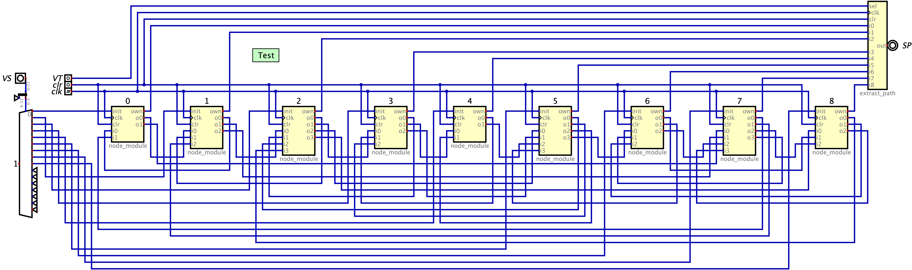

# Implementation of a Distributed Shortest Path Length Algorithm on the Arduino MKR Vidor 4000

This project is part of the course Neuromorphic Engineering 2122 at Radboud University.

Authors:  Arne Diehl & Thijs Luttikholt

## Usage
Open the project in `quartus/MKRVIDOR4000.qpf` in quartus and compile the bitstream. Use the steps detailed in the [JTAG repository](https://github.com/HerrNamenlos123/JTAG_Interface) to place it on the device. Further communication takes place via the serial monitor, where you can enter the numbers of the vertices you want to use as initial and terminal vertices.
