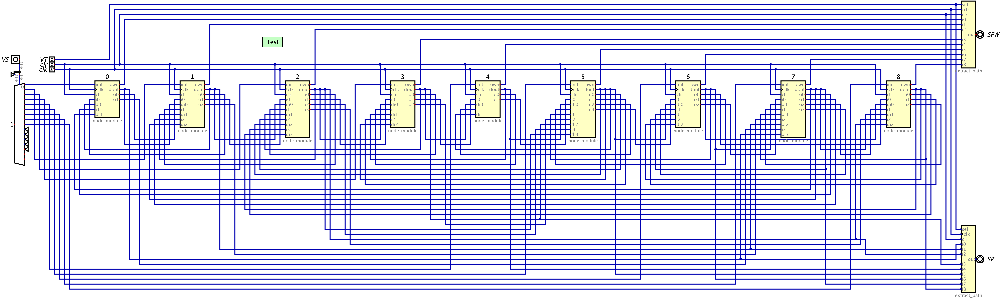

# Implementation of a Distributed Shortest Path Algorithm on the Arduino MKR Vidor 4000

This project is part of the course Neuromorphic Engineering 2122 at Radboud University.

Authors:  Arne Diehl & Thijs Luttikholt

## Usage
### On-Device
1. Install the Arduino library in your Arduino IDE. You can find the library in the directory `arduino/libraries/FPGA_Controller`. See the official [guide](http://www.arduino.cc/en/Guide/Libraries) for help with this step.
2. Open the FPGA_Tester.ino in the Arduino IDE and upload it to the device.
3. Open the Serial Monitor and enter two digits (ranging from 0 to 8) at once. For example "72".
4. Observe the output in the Serial Monitor.

### In Digital
If you do not have access to the Arduino MKR Vidor 4000, you can simulate the circuit in [Digital](https://github.com/hneemann/Digital).
1. Open Digit.jar (or any other build of Digital)
2. Open `digital/example.dig`.
3. Click on the play button which starts the simulation of the circuit.
4. Click on the 'clr' input and set this value to 1.
5. Click on input "VS" and set the value to the number of the node that should be the initial vertex.
5. Click on input "VT" and set the value to the number of the node that should be the terminal vertex.
6. Click on the 'clr' input and set this value to 0.
7. Observe the value displayed at the outputs named "SP" and "SPW". Note that its value is displayed in hexadecimal notation.

## License
The files in directory `quartus` are released under the MIT license, which can be found in the file called [LICENSE](quartus/LICENSE).

Everything else in this repository is released under the GNU General Public License v3.0 which you can find in the file called [LICENSE](LICENSE).

## Documentation
You can find images of all graphs as well as a schematic of the circuits integration with JTAG in the directory `docs/images`.

In the directory `docs/tests`, there are several csv files describing the output of test cases to indicate the correctness of every component.

## References
This project makes use of the following projects:
* [JTAG_Interface](https://github.com/HerrNamenlos123/JTAG_Interface/tree/07b673bd0892cdd0b41e93349961aeb7feae428e)
* [Digital v0.28](https://github.com/hneemann/Digital)
* [Quarev Telegram Bot](https://github.com/adiehl96/quarevTelegramBot/tree/cfc24fd174689d963be4a7853fe5772c7890ee32)